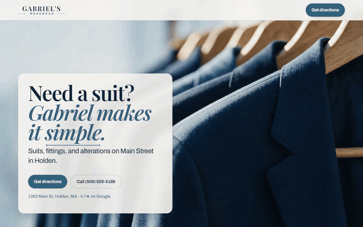

# Gabriel's Menswear

A scroll-driven site for a menswear shop on Main Street in Holden, Massachusetts. Scrolling is the timeline: video scrubs frame by frame under the wheel, sections pin and hold while their copy advances, a rail pans sideways, and the page background travels through the palette as you go.



[Full 34-second capture](.github/media/scroll.mp4) · [Live site](https://gabriels-menswear.vercel.app)

## What this is

Gabriel Sr. fits suits, runs alterations, and dresses people for weddings, proms, and funerals. The brief was a shop site that reads as a real local business and still earns a second look. No framework and no build step. Three files do the work: `index.html`, `scrollcraft.css`, `scrollcraft.js`.

The homepage runs 18,132px tall at 1280x800, about 23 viewport heights, across 10 scroll acts.

## The scroll engine

`scrollcraft.js` is 1,167 lines of vanilla JavaScript with zero dependencies. You mark up sections with `data-sc-*` attributes and the engine drives them from a single `requestAnimationFrame` loop.

```html
<section data-sc-act="scrub" data-sc-span="2.2" data-sc-drift="#f7f5f1">
  <div data-sc-stage>
    <video data-sc-scrub data-sc-src="assets/h2-01.mp4"
           data-sc-src-mobile="assets/h2-01-m.mp4" muted></video>
    <div class="sc-copy" data-sc-cue="0 0.8 0">
      <h1 data-sc-kinetic="lines">Need a suit? Gabriel makes it simple.</h1>
    </div>
  </div>
</section>
```

Four act types cover the page:

| Act | What it does | Used for |
|---|---|---|
| `scrub` | Sticks a stage and scrubs a clip's `currentTime` against scroll | The hero |
| `pin` | Sticks a stage for `data-sc-span` viewport heights while cues fire | The week, the wedding, the stitch |
| `pan` | Translates a wide rail sideways as you scroll down | The occasions rail |
| `flow` | Normal document flow with a one-shot reveal on entry | Reviews, FAQ, visit |

Every act exposes a normalized progress `p` from 0 to 1 and publishes it as the `--sc-p` custom property, so CSS can read the same clock the JavaScript does. `data-sc-span` is measured in viewport heights, which keeps the timing honest across screen sizes.

Devices that hang off `p`:

- `data-sc-scrub` seeks a video. Clips load as blobs so seeks land where you ask.
- `data-sc-kinetic="lines|words|chars"` splits a headline and staggers the pieces.
- `data-sc-cue="0.18 0.42 0.1 0.14"` fades and rises a block inside a window of the act.
- `data-sc-drift="#e7edf1"` interpolates the page background toward a colour while the act is on screen.
- `data-sc-pan`, `data-sc-parallax`, `data-sc-reveal`, `data-sc-count` handle the rest.
- `data-sc-tilt`, `data-sc-magnet`, `data-sc-spotlight` answer the pointer instead of the scroll.

One smoothed clock drives every scrub clip on the page. Each frame, the loop moves a clip's `currentTime` a fixed fraction of the way toward where the scroll says it should be. That deliberate lag is what keeps the video from stuttering when someone flicks the wheel.

A `worldflight` mode chains several clips into one continuous camera move and crossfades the seams, so a run of pinned sections reads as one world.

## Decisions worth reading the code for

**Reduced motion gets its own version of the page.** Under `prefers-reduced-motion: reduce`, cues still fade so the copy still arrives in order, translation collapses, and the video clips are never fetched at all. The poster frame holds. Pointer effects switch off.

**Mobile gets different files.** `data-sc-src-mobile` serves a lighter cut of each clip, and pointer effects are gated behind `(hover: hover) and (pointer: fine)`, so a phone never downloads work it cannot use.

**The markup stays semantic.** Sections carry `aria-label`, headings nest in order, and there is a skip link. The kinetic text splitter rebuilds headlines from spans but leaves the accessible name intact.

**Structured data covers the whole shop.** `MensClothingStore` and `LocalBusiness`, opening hours, a service and offer catalog, `FAQPage` matching the visible FAQ, `BreadcrumbList`, `WebSite`, and `WebPage`. Keep the visible FAQ text and the FAQ schema answers in sync when either changes.

## Running it

Static files, so any server works.

```powershell
python -m http.server 4173 --bind 127.0.0.1
```

Open `http://127.0.0.1:4173/index.html`.

Check the one loose script before committing:

```powershell
node --check .\script.js
```

## Recording the scroll capture

`scripts/capture-scroll.cjs` drives the page with an eased scroll in headless Chromium and records the result, so the clip in this README can be regenerated after any change.

```powershell
npm i -D playwright; npx playwright install chromium; node scripts/capture-scroll.cjs
```

It reads `URL`, `OUT`, `TO` (scroll target in px), `SECONDS`, `W` and `H` from the environment. The GIF above came from `TO=5100 SECONDS=15`, the full capture from `TO=11900 SECONDS=32`, both converted with ffmpeg.

## Layout

```
index.html          the page, including its JSON-LD
scrollcraft.js      the scroll engine (no dependencies)
scrollcraft.css     stage, stickiness, cue and kinetic styles
styles.css          the shop's own type and layout
script.js           nav, FAQ toggles, small page behaviour
assets/             clips, posters, photography, favicons
DESIGN.md           colour, type and spacing tokens
tokens.json         the same tokens as JSON
scripts/            capture and setup scripts
scrollcraft/        the build brief, score notes and asset generators
```

## Deployment

Vercel, connected to `main`. Pushing deploys. `AGENTS.md` carries the project IDs and the manual deploy path.
