# Gabriel's Menswear

A scroll-driven site for a menswear shop on Main Street. Video scrubs frame by frame under the wheel, sections pin while their copy advances, and a rail of occasions pans sideways as you travel down the page.

Built for Gabriel Sr. at 1363 Main Street, Holden, Massachusetts. Live at [gabriels-menswear.vercel.app](https://gabriels-menswear.vercel.app).

One pass down the whole page, desktop beside phone, sped up to fit here:

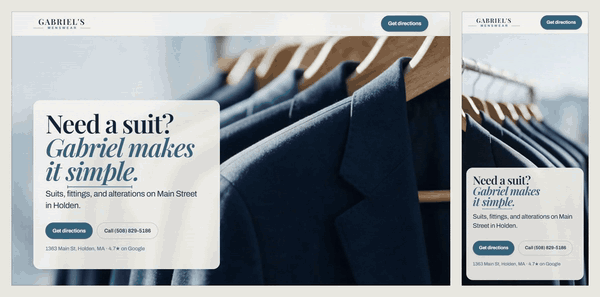

<video src="https://github.com/harleydoughertyart-sketch/gabriels-menswear/raw/main/.github/media/journey.mp4" controls muted playsinline width="100%"></video>

**[Watch it at reading speed, 46 seconds →](.github/media/journey.mp4)**

---

## The problem

Gabriel Sr. dresses Holden for weddings, proms, first interviews and funerals. He has worked out of the same shop for years, and the people who need him find him by asking someone who already knows him.

Two versions of this site fail. A template with a stock photo and an address gets found and forgotten. A showpiece that hides the phone number under an animation wins nothing for a man who needs a suit by Saturday.

The constraint that shaped the rest: **someone lands on a phone, needs a funeral suit tomorrow, and has to reach the shop in one tap.** The header CTA never leaves the screen, the hero carries the number in plain text, and the page still works with the motion switched off.

The rest of it is the part that earns a second look.

## What you get

The hero holds a clip of the rack. Scroll and the footage advances against your wheel instead of running on its own clock, so you set the pace.


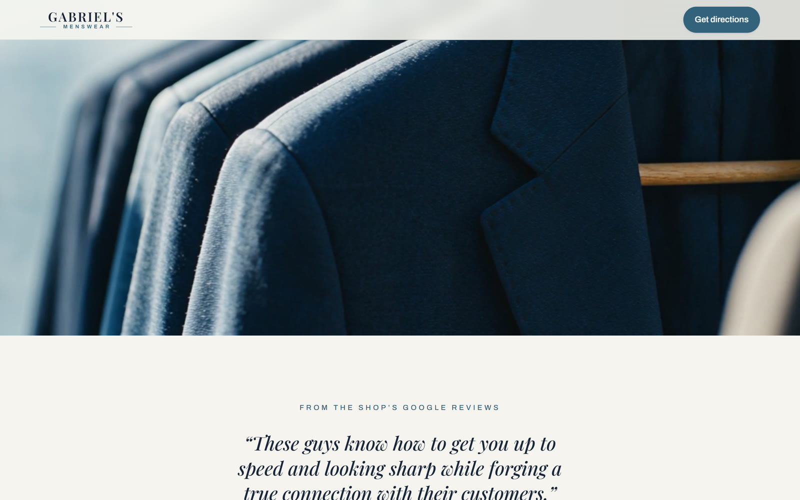

Then the page sticks. The week arrives one line at a time, each question sitting alone on a pale ground while the background drifts colour underneath it.

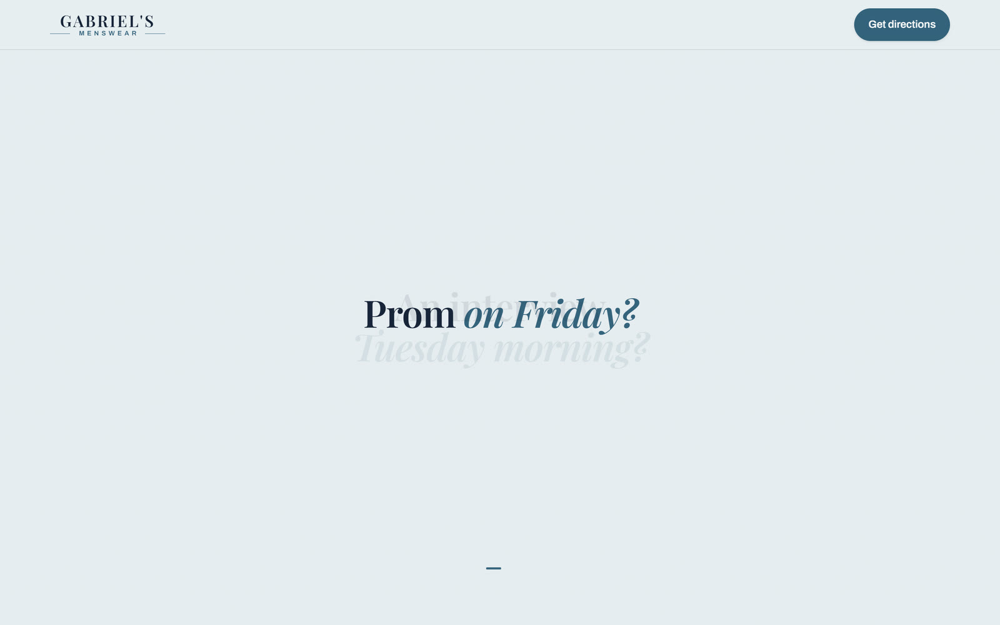

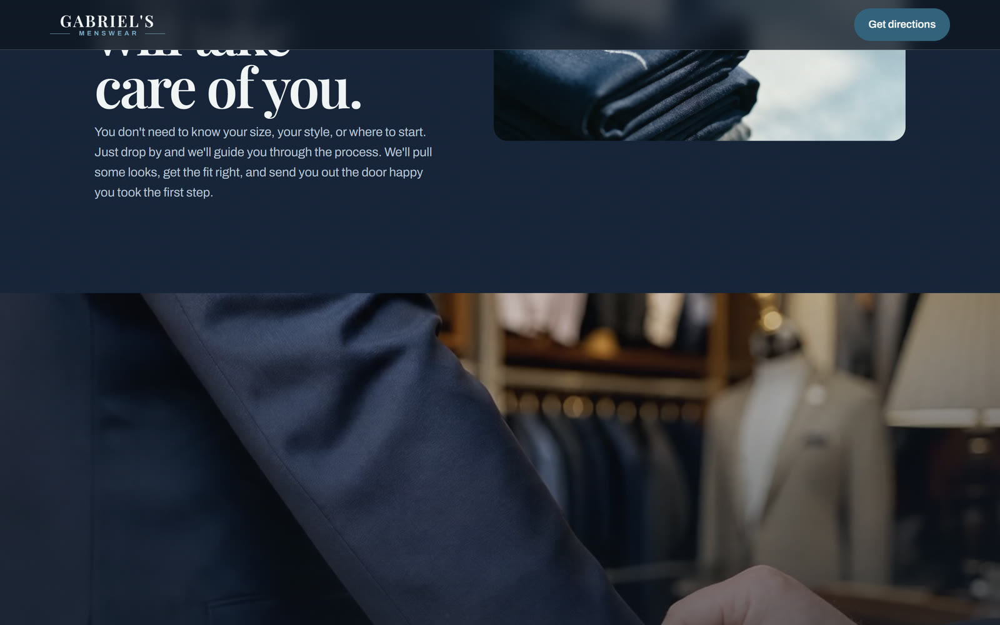

The wedding act runs a fitting from chalk mark to finished sleeve across four and a half viewport heights of scroll.


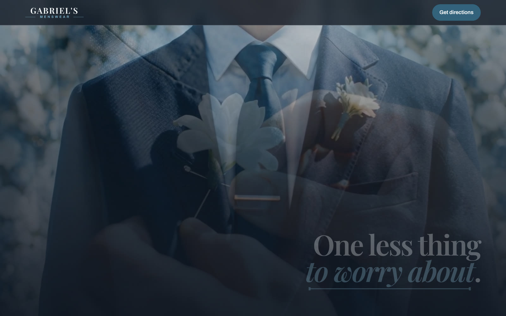

The occasions rail breaks the vertical. You keep scrolling down and the shelf travels left, the one move on the page that argues with the direction of your hand.

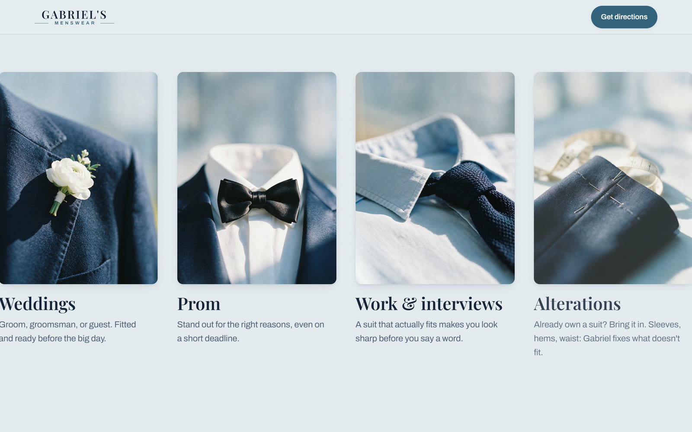

Then it closes in tight on the cloth before handing you the reviews, the FAQ and the way in.

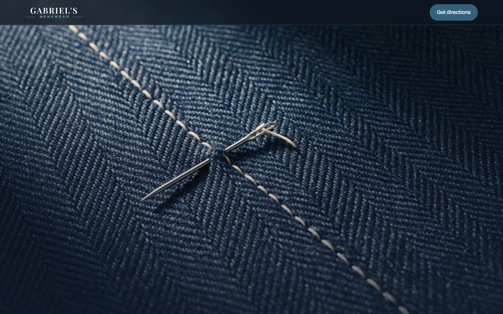

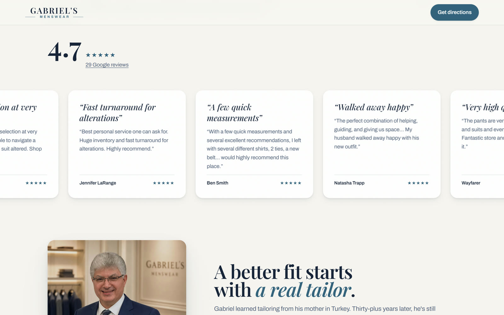

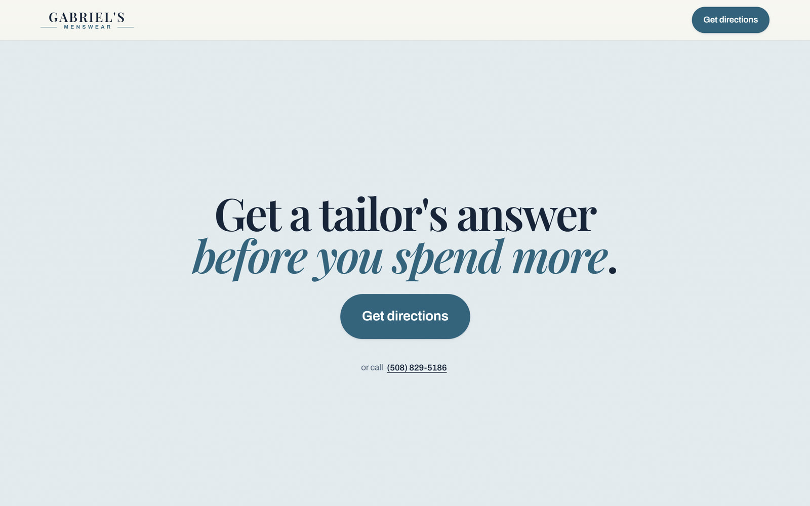

---

## How it works

No framework and no build step. Three files carry the page: `index.html`, `scrollcraft.css`, and `scrollcraft.js`.

`scrollcraft.js` is 1,167 lines of vanilla JavaScript with zero dependencies. You mark a section up with `data-sc-*` attributes and one `requestAnimationFrame` loop drives it.

```html
<section data-sc-act="scrub" data-sc-span="2.2" data-sc-drift="#f7f5f1">
  <div data-sc-stage>
    <video data-sc-scrub data-sc-src="assets/h2-01.mp4"
           data-sc-src-mobile="assets/h2-01-m.mp4" muted></video>
    <div class="sc-copy" data-sc-cue="0 0.8 0">
      <h1 data-sc-kinetic="lines">Need a suit? Gabriel makes it simple.</h1>
    </div>
  </div>
</section>
```

Four act types cover the homepage's ten acts:

| Act | What it does | Where |
| --- | --- | --- |
| `scrub` | Sticks a stage and drives a clip's `currentTime` from scroll | The hero |
| `pin` | Sticks a stage for `data-sc-span` viewport heights while cues fire | The week, the wedding, the stitch |
| `pan` | Translates a wide rail sideways as you scroll down | The occasions rail |
| `flow` | Ordinary document flow with a one-shot reveal on entry | Reviews, FAQ, visit |

Every act exposes a normalized progress from 0 to 1 and publishes it as the `--sc-p` custom property, so a stylesheet reads the same clock the JavaScript does. `data-sc-span` counts viewport heights, which holds the timing together from a phone to a 27-inch monitor.

Devices that hang off that progress:

| Attribute | Effect |
| --- | --- |
| `data-sc-scrub` | Seeks a video against scroll |
| `data-sc-kinetic` | Splits a headline into lines, words or characters and staggers them |
| `data-sc-cue="0.18 0.42 0.1 0.14"` | Fades and rises a block inside a window of the act |
| `data-sc-drift="#e7edf1"` | Interpolates the page background toward a colour |
| `data-sc-pan`, `data-sc-parallax` | Sideways travel and depth |
| `data-sc-reveal`, `data-sc-count` | Clip-path wipes and number blooms |
| `data-sc-tilt`, `data-sc-magnet`, `data-sc-spotlight` | Answer the pointer rather than the scroll |

A `worldflight` mode chains several clips into one continuous camera move and crossfades the seams, so a run of pinned sections reads as one place.

### Three things harder than they sound

**A video will not seek where you point it.** Hand a `<video>` an ordinary `src` and the browser streams it, so a seek lands on whichever keyframe it happens to hold. The engine fetches each clip and loads it as a blob first. That costs a wait on entry and buys frame-accurate scrubbing for the rest of the act.

**Following the scroll exactly looks broken.** An early version set `currentTime` straight from scroll position, and a flick of the wheel turned the footage into a strobe. One clock now moves every clip a fixed fraction of the way toward its target each frame. That deliberate lag is the difference between footage that tracks your hand and footage that stutters.

**The capture script fights the stylesheet.** `scrollcraft.css` sets `scroll-behavior: smooth` for the anchor links in the nav. A wheel ignores that property, so nobody notices. A scripted `scrollTo` obeys it, and the first recording crawled at a third speed with every frame animating against the last. `scripts/capture-scroll.cjs` overrides it, which is the only way the recording matches what a visitor sees.

---

## Motion off, and phones

Reduced motion gets its own version of the page rather than a dead one. Cues still fade, so the copy arrives in the order Gabriel's writer put it. Translation collapses. The clips are never fetched and the poster frame holds, which turns the heaviest page on the site into the lightest one.

Phones get different files. `data-sc-src-mobile` serves a lighter cut of each clip, and the pointer effects sit behind `(hover: hover) and (pointer: fine)`, so a phone downloads no work it cannot use.

<p>
  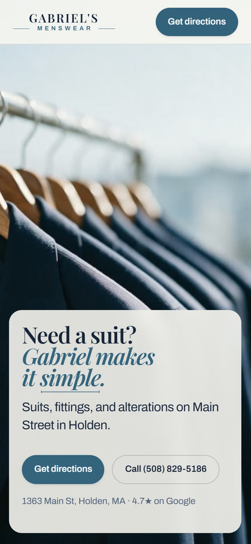
  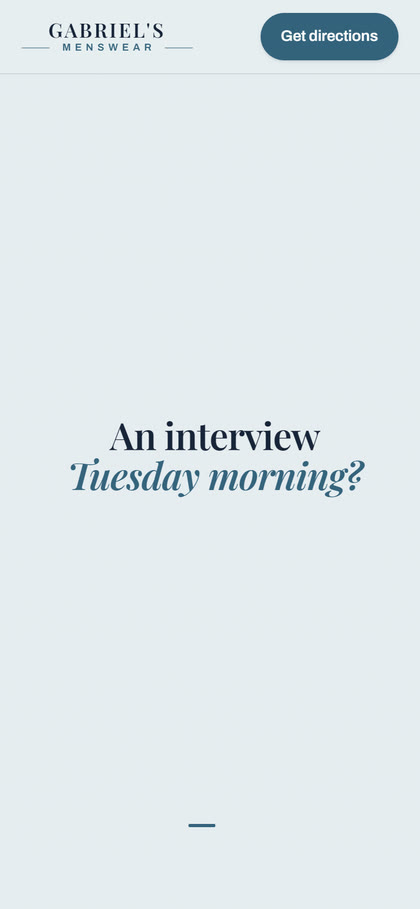
  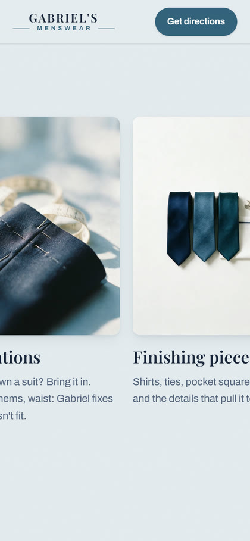
</p>

The kinetic splitter rebuilds a headline out of per-line spans and leaves the accessible name intact, so a screen reader hears the sentence instead of eleven fragments.

## Getting found

A shop site earns its keep in the search result, so the page carries the structured data to match: `MensClothingStore` and `LocalBusiness` with opening hours and a postal address, a service and offer catalog, `FAQPage` mirroring the visible FAQ, plus `BreadcrumbList`, `WebSite` and `WebPage`.

Change the FAQ copy and change the schema answer with it. They have to agree.

## The code

| File | What it holds |
| --- | --- |
| [`scrollcraft.js`](scrollcraft.js) | The engine. Acts, cues, the scrub clock, worldflight, pointer effects |
| [`scrollcraft.css`](scrollcraft.css) | Stages, stickiness, cue and kinetic styles |
| [`index.html`](index.html) | The page and its JSON-LD |
| [`styles.css`](styles.css) | The shop's own type and layout |
| [`scripts/capture-journey.cjs`](scripts/capture-journey.cjs) | Records the desktop and phone passes at the top of this page |
| [`scripts/capture-scroll.cjs`](scripts/capture-scroll.cjs) | Records a shorter desktop-only pass |
| [`scripts/capture-stills.cjs`](scripts/capture-stills.cjs) | Screenshots the positions used above |
| [`DESIGN.md`](DESIGN.md) | Colour, type and spacing, read back out of the shipping site |

The header comment in `scrollcraft.js` documents the whole attribute vocabulary. Start there.

## Built with

Plain HTML, CSS and JavaScript · no framework, no build step, no animation library · Newsreader and IBM Plex Sans · Playwright and ffmpeg for the captures · Vercel

## Running it

```powershell
python -m http.server 4173 --bind 127.0.0.1
```

Open `http://127.0.0.1:4173/index.html`.

Re-record the media after a visual change:

```powershell
npm i -D playwright; npx playwright install chromium; node scripts/capture-journey.cjs; node scripts/capture-stills.cjs
```

Every script reads `URL` and `OUT` from the environment. `capture-journey.cjs` takes `SECONDS` and records both viewports in step; ffmpeg stands the two recordings side by side and speeds the result up for the GIF. `capture-scroll.cjs` takes `TO`, `SECONDS`, `W` and `H` for a single-viewport pass over part of the page.

---

Built for a working shop, and still serving it. Ask me if you want to do something with any of it: [harleydoughertyart@gmail.com](mailto:harleydoughertyart@gmail.com).
